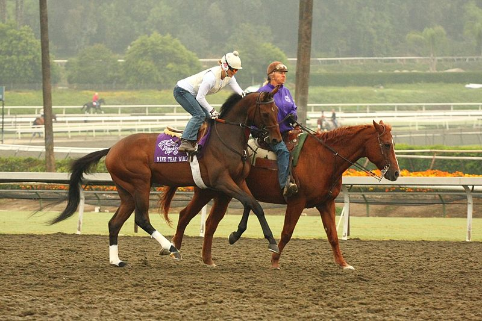

# Object Detection with YOLOv5

In this project, I trained the YOLOv5 model from scratch for object detection, starting with the preparation and handling of the data. The training process was conducted using Google Colab, leveraging Google Drive as a storage solution. The V100 GPU in Google Colab was utilized to ensure efficient training. Finally, I conducted tests on both images and videos to demonstrate the capabilities of the trained model.

The model was specifically trained for the detection of the following objects:

01. Person
02. Car
03. Chair
04. Bottle
05. Sofa
06. Bicycle
07. Horse
08. Boat
09. Motor Bike
10. Cat
11. TV Monitor
12. Cow
13. Sheep
14. Aero Plane
15. Train
16. Dining Table
17. Bus
18. Potted Plan
19. Bird
20. Dog

## Table of Contents

- [Files Overview](#files-overview)
- [Hardware Used](#hardware-used)
- [Installation](#installation)
- [Usage](#usage)
- [Test Results](#test-results)
- [Contributing](#contributing)
- [License](#license)

## Files Overview

- **01. Data_Preparation.ipynb**: A Jupyter Notebook for data preparation, including data loading, cleaning, extraction, and visualization.
  - **Requirements**: Python libraries such as pandas, NumPy, OpenCV, etc. (as needed in your code).

- **02. YOLO_training.ipynb**: A Jupyter Notebook for training the YOLOv5 model using Google Colab and Google Drive.
  - **Requirements**: Google Colab environment, V100 GPU, YOLOv5 repository, specific Python libraries from `requirements.txt`.

- **03. yolo_predictions.py**: A Python script containing a class for object detection using the trained YOLO model and OpenCV.
  - **Requirements**: OpenCV, NumPy, YAML, etc. (as needed in your code).

- **04. test_for_images_and_videos.py**: A Python script for importing the YOLO prediction class and predicting objects in a given image or video.
  - **Requirements**: OpenCV, YOLO_Pred class from `03. yolo_predictions.py`.

## Hardware Used

- **GPU**: NVIDIA Tesla V100
- **Storage**: Google Drive
- **Computing Environment**: Google Colab

## Installation

1. Clone the repository: [visite the github repository](https://github.com/ultralytics/yolov5)

2. Install the required packages from the `requirements.txt` file:

## Usage

### Data Preparation

Open `01. Data_Preparation.ipynb` in Jupyter Notebook and follow the instructions to prepare the data.

### Training the YOLO Model

Open `02. YOLO_training.ipynb` in Google Colab and follow the instructions to train the model.

### Making Predictions

Use the `YOLO_Pred` class from `03. yolo_predictions.py` to make predictions on images or videos.

### Testing

Run `04. test_for_images_and_videos.py` to test the predictions on specific images or videos.

## Test Results

Below are some examples of test results, demonstrating original images and corresponding images with predictions:

- **Original Image 1**: 
- **Prediction Image 1**: 

- **Original Image 2**: 
- **Prediction Image 2**: 

(Add more images as needed)

## Contributing

Feel free to contribute by submitting pull requests or opening issues.

